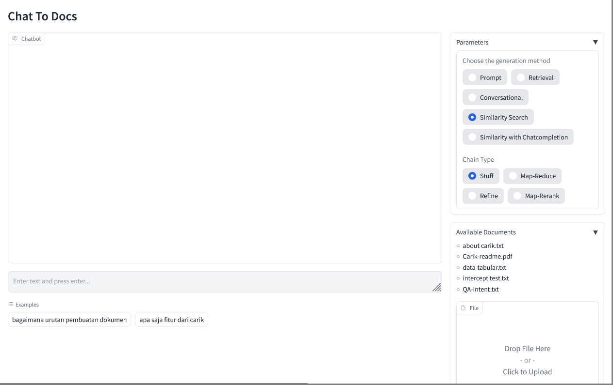

# Create a Chatbot for Your Data/Documents

| [Indonesian](README.md) | [English](README-EN.md) |

This repository contains an Artificial Intelligence (AI) system that utilizes chat technology to interact with data/documents. The system is built using Docker to simplify usage and installation, eliminating the need to install software/plugins/package dependencies one by one.


## Usage

1. Copy the files you want to use into the `docs/nama_dokumen_anda` folder in this repository.
2. Modify the necessary configurations in the .env file according to your needs.


## Environment

Several configurations can be modified through the  `.env`.

| Variable | Description |
|---|---|
| DOCUMENT_NAME | Document name corresponding to the folder name you created in `docs/nama_dokumen_anda` |
| OPENAI_API_KEY | OpenAI API Key obtained from https://platform.openai.com/account/api-keys |
| ANSWERING_MODE | There are several available answering modes: `prompt`, `retrieval`, `conversational`, `similarity search`, and `similarity with chatcompletion`. <br>Each has its own advantages and disadvantages. |
| DB_TYPE | Supported database vector: `chromadb` atau `faiss`. |
| WEB_FRAMEWORK | Currently, there are two web framework modes available: `gradio` dan `flask` |
| PORT | Port for the web server. The default is port 8088. |


## Installation and Configuration

1. Ensure that Docker is installed on your computer.
<br>Prepare approximately 8GB of storage space to download the required Docker image.
2. Run the following command to build the Docker image:

    ```
    docker build . -t chat2doc-ex
    ```

3. After the build process is complete, run the following command to start the application:

    ```
    docker run -it --rm --name c2d -p 8088:8088 chat2doc-ex
    ```

    If the process runs smoothly, a web server will be active on port 8088.

4. Once the web server is running, you can access the application through the browser by opening the following link: [http://localhost:8088](http://localhost:8088)

The interface will look similar to this:




## Notes

1. The *initial build* process may take a considerable amount of time as Docker will download a ready-to-use container image with a size of approximately 7GB. Ensure that your bandwidth and quota are sufficient.
2. Whenever there are changes to the documents or configurations, you need to rebuild the Docker image, unless you have a deeper understanding of Docker. Alternatively, you can make configuration changes through the Docker command line.

---

*Note: If you encounter any issues or have questions, please create an _issue_ in this repository.*