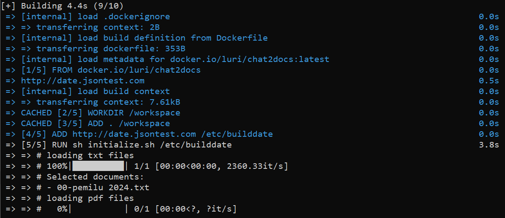

# Create a Chatbot for Your Documents/Data

| [Indonesian](README.md) | [English](README-EN.md) |


[Chat2Docs](https://carik.id/chat2docs/) is an application that allows you to ask questions and get answers based on available documents. You can use documents in PDF, DOCX, CSV, MD, or TXT formats. This application is very useful for searching for information contained in laws, regulations, company SOPs, tutorials, and other documents.

The system is built using Docker to simplify usage and installation, eliminating the need for individual software/plugin/dependency package installations.

## Key Features

1. Ask questions and get relevant answers from documents.
2. Supports various document formats, including PDF, DOCX, CSV, MD, and TXT.
3. Simple and user-friendly webchat interface.

## System Requirements

Before using Chat2Docs, make sure you meet the following requirements:
1. Have [Docker](https://www.docker.com/) installed on your device.


## Environment

Some configurations can be modified through the `.env` file.

| Variable | Description |
|---|---|
| DOCUMENT_NAME | Document name according to the folder name you create in `docs/nama_dokumen_anda` |
| OPENAI_API_KEY | OpenAI API Key obtained from https://platform.openai.com/account/api-keys |
| ANSWERING_MODE | Default answering mode. There are several available answering modes: `prompt`, `retrieval`, `conversational`, `similarity search`, dan `similarity with chatcompletion`. <br>Each has its advantages and disadvantages. |
| DB_TYPE | This platform supports vector databases: `chromadb` or `faiss`. |
| WEB_FRAMEWORK | Currently, there are 2 web framework modes available: `gradio` dan `flask`. API tersedia jika menggunakan framework. |
| PORT | Port for the web server. Default is port 8088 |


## Installation and Usage

1. Make sure [Docker](https://www.docker.com/) is installed on your computer.
   
   Allocate approximately 8GB of storage space to download the required Docker image.

2. Clone this repository from the terminal/console using the command:

   ```bash
   git clone https://github.com/luridarmawan/chat2docs.git
   ```

3. Copy the file you want to use into the `docs/nama_dokumen_anda` folder in this repository. Chat2Docs supports PDF, DOCX, MD, or TXT document formats.

   Currently, there are example folders available: `example` and `pemilu2024`.

4. Run the following command to build the Docker image:

   ```bash
   docker build . -t chat2doc-ex
   ```

   

5. Once the build process is completed, run the following command to start the application:

   ```
   docker run -it --rm --name c2d -p 8088:8088 chat2doc-ex
   ```

   If the process runs successfully, a web server will be active on port 8088.

   

6. After the web server is running, you can access the application through a browser by opening the following link: [http://localhost:8088](http://localhost:8088)

   The interface will look similar to this:

   

7. Type your question in the provided column and press _Enter_.
8. Chat2Docs will extract relevant information from the document and provide the best answer to your question.


## Docker compose

Alternatively, you can use Docker Compose by running the following Docker command:

```bash
docker-compose up --build
```
   The result will be similar to this:

   


## Showcase

Below is a screenshot example when Chat2Docs is active using the `pemilu2024` document:


## Notes

1. The initial build process may take a considerable amount of time because Docker will download a ready-to-use container image with a size of approximately 7 GB. Make sure your bandwidth and quota are sufficient.
2. Whenever there are changes to the document or configuration, you need to rebuild the Docker image unless you have a deeper understanding of Docker. OR, you can make configuration changes through the Docker command line.

---

*Catatan: Jika Anda mengalami masalah atau memiliki pertanyaan, silakan buat *issue* di repositori ini.*