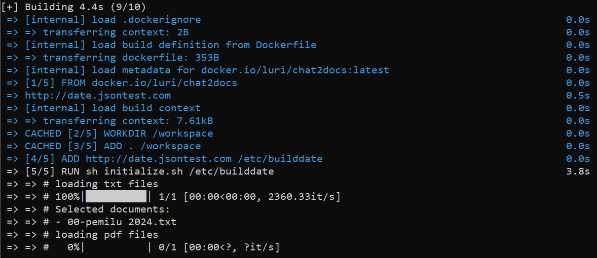
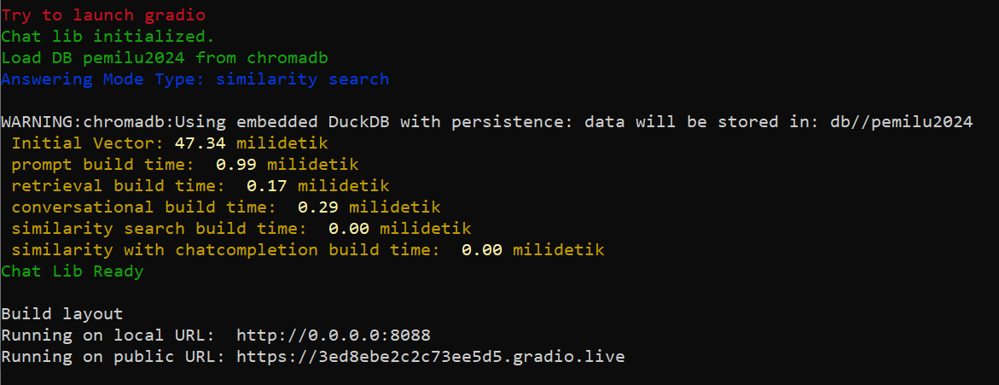
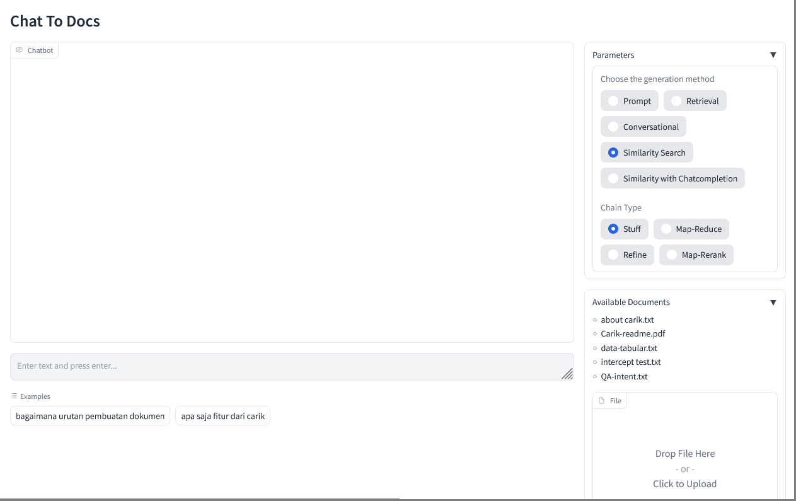
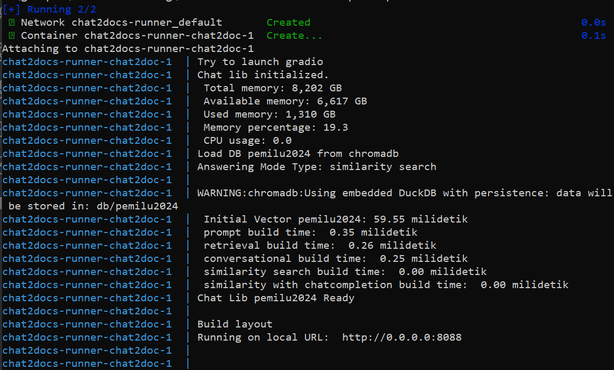
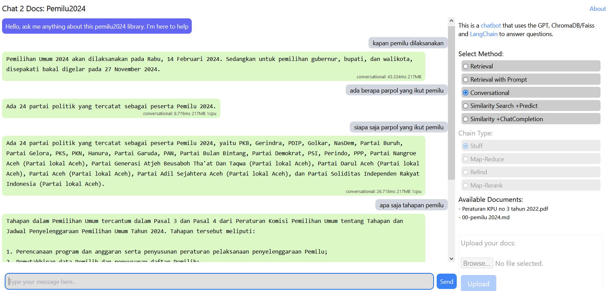
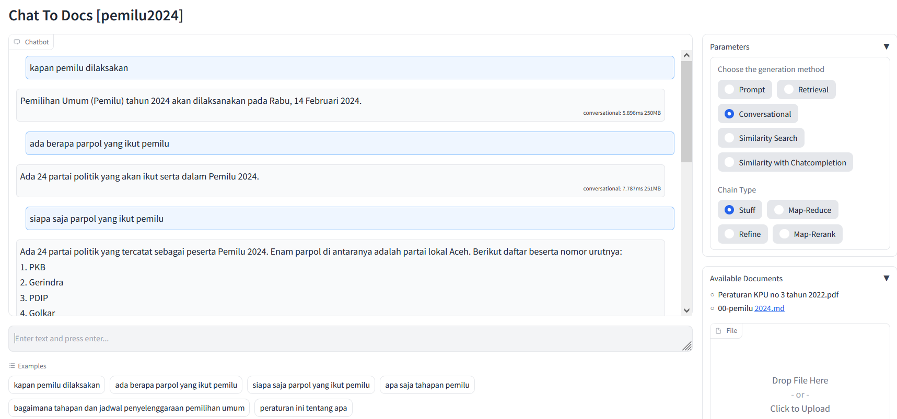

# Create a Chatbot for Your Documents/Data

| [Indonesian](README.md) | [English](README-EN.md) |


[Chat2Docs](https://carik.id/chat2docs/) ini adalah aplikasi yang memungkinkan Anda untuk mengajukan pertanyaan dan mendapatkan jawaban berdasarkan dokumen yang tersedia. Anda dapat menggunakan dokumen dalam format PDF, DOCX, CSV, MD, atau TXT. Aplikasi ini sangat berguna untuk mencari informasi yang terkandung dalam undang-undang, peraturan, SOP perusahaan, tutorial, dan dokumen lainnya.

Sistem ini dibangun menggunakan Docker untuk mempermudah penggunaan dan instalasi sehingga tidak perlu lagi melakukan instalasi perangkat lunak/plugin/paket dependensi satu-persatu.

## Fitur Utama

1. Mengajukan pertanyaan dan mendapatkan jawaban yang relevan dari dokumen.
2. Mendukung berbagai format dokumen, termasuk PDF, DOCX, CSV, MD, dan TXT.
3. Antarmuka _webchat_ yang sederhana dan mudah digunakan.

## Persyaratan Sistem

Sebelum menggunakan Chat2Docs, pastikan Anda telah memenuhi persyaratan berikut:
1. Sudah memiliki [Docker](https://www.docker.com/) diinstal di perangkat Anda


## Environment

Beberapa konfigurasi dapat diubah melalui file `.env`.

| Variabel | Deskripsi |
|---|---|
| DOCUMENT_NAME | Nama dokumen sesuai dengan nama folder yang Anda buat di `docs/nama_dokumen_anda`.<br>Tersedia contoh dokumen: `example` dan `pemilu2024`. |
| OPENAI_API_KEY | API Key OpenAI yang dapat diperoleh dari  https://platform.openai.com/account/api-keys |
| ANSWERING_MODE | Mode jawaban default. Terdapat beberapa mode answering yang tersedia: `prompt`, `retrieval`, `conversational`, `similarity search`, dan `similarity with chatcompletion`. <br>Masing-masing mempunyai kelebihan dan kekurangannya. |
| DB_TYPE | Platform ini mendukung database vector: `chromadb` atau `faiss`. |
| WEB_FRAMEWORK | Saat ini tersedia 2 mode web framework: `gradio` dan `flask` |
| PORT | Port untuk server web. Default menggunakan port 8088 |


## Instalasi dan Penggunaan

1. Pastikan [Docker](https://www.docker.com/) telah terinstall di komputer Anda.
   
   Persiapkan ruang penyimpanan sebesar lebih kurang 8GB untuk mengunduh image docker yang dibutuhkan.

2. _Clone_ repository ini dari dari terminal/console dengan perintah 
    ```bash
    git clone https://github.com/luridarmawan/chat2docs.git
    ```
3. Salin file yang ingin gunakan ke dalam folder `docs/nama_dokumen_anda` di repositori ini. Chat2Docs mendukung format dokumen pdf, docx, md, atau txt.

   Saat ini tersedia contoh folder `example` dan `pemilu2024`.

4. Jalankan perintah berikut untuk membangun image Docker:

   ```bash
   docker build . -t chat2doc-ex
   ```

   

5. Setelah proses *build* selesai, jalankan perintah berikut untuk menjalankan aplikasi:

   ```
   docker run -it --rm --name c2d -p 8088:8088 chat2doc-ex
   ```

   Jika proses berjalan lancar, akan aktif sebuah web server yang berjalan di port 8088.

   

6. Setelah web server berjalan, Anda dapat mengaksesnya aplikasi melalui browser dengan membuka tautan berikut: [http://localhost:8088](http://localhost:8088)

   Tampilannya akan kurang lebih seperti ini:

   

7. Ketik pertanyaan Anda pada kolom yang disediakan dan tekan _Enter_.
8. Chat2Docs akan mengekstrak informasi yang relevan dari dokumen dan memberikan jawaban terbaik untuk pertanyaan Anda


## Docker compose

Alternatif bisa menggunakan docker compose, bisa dilakukan dengan menjalankan perintah docker berikut:

```bash
docker-compose up --build
```
   Hasilnya akan kurang lebih seperti ini:

   


## Showcase

Dibawah ini contoh tangkapan layar ketika chat2doc sedang aktif menggunakan dokumen `pemilu2024`:

### menggunakan flask

   

### menggunakan gradio

   


## Catatan

1. Proses *build* pertama kali akan memakan waktu yang cukup lama karena Docker akan mengunduh gambar kontainer siap pakai dengan ukuran sekitar 7 GB. Pastikan bandwidth dan kuota Anda mencukupi.
2. Setiap ada perubahan pada dokumen ataupun konfigurasi, Anda harus build ulang docker image-nya, keculai kika anda memahami lebih dalam tentang docker. ATAU, Anda bisa melakukan perubahan konfigurasi melalui *command line* docker.

---

*Catatan: Jika Anda mengalami masalah atau memiliki pertanyaan, silakan buat *issue* di repositori ini.*